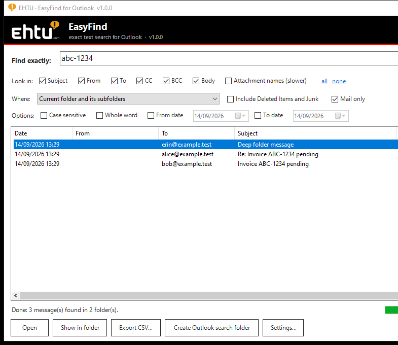
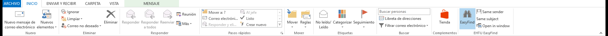

<p align="center"></p>

# EHTU EasyFind for Outlook

**Exact-text search for classic Microsoft Outlook**, by [EHTU Informàtica](https://ehtu.com).

Type an invoice number, part of an e-mail address or any phrase and EasyFind lists every message that
contains exactly that text – in the subject, sender, recipients (To / CC / BCC), body or attachment
names – in the current folder, in one mailbox or PST, or in everything at once. It asks the mail store
directly, so it works even when Outlook's own search index is incomplete or disabled.

## Download

**[⬇ Download the latest installer (EasyFindSetup-x.y.z.exe)](https://github.com/EhtuCom/easyfind-outlook/releases/latest)**

Run the setup as the user who uses Outlook – no administrator rights are needed. If Outlook is open the
setup asks to close it and starts it again. The add-in appears on the **Home** tab of the mail view as
the **EHTU EasyFind** group.

Updating: run a newer installer over the old one, or click the *Update available* link that EasyFind
shows in its window when a new release is published here.

**Digital signature.** The installer, the add-in and the uninstaller are signed by *EHTU Informàtica*
with a timestamp. The certificate is currently self-signed, so Windows SmartScreen may still show
"Unknown publisher → More info → Run anyway" on first run. Organisations that deploy EasyFind can trust
the certificate on their PCs (import [`docs/EHTU-CodeSigning.cer`](docs/EHTU-CodeSigning.cer) into
*Trusted Root Certification Authorities* and *Trusted Publishers*, e.g. through Group Policy); the
signature then verifies as trusted.

<p align="center"></p>
<p align="center"></p>

## Requirements

| | |
|---|---|
| Outlook | Classic desktop Outlook 2013, 2016, 2019, 2021, LTSC or Microsoft 365 (32 or 64 bit). The "new Outlook" app cannot load add-ins that access the mailbox and is not supported. |
| Windows | Windows 10 / 11. Uses the .NET Framework 4.8 that is part of Windows – nothing else to install. |
| Rights | Per-user installation, no administrator account required. |

## Features

- Exact substring search (`1234` finds `ABC-1234`), optional *case sensitive* and *whole word*.
- Look in Subject, From, To, CC, BCC, Body and attachment names, in any combination.
- Scope: current folder, current folder + subfolders, a whole mailbox or PST, everything, or any
  folder picked from a tree; date range; mail only or every item type; Deleted Items / Junk optional.
- Results with date, sender, recipients, subject, folder and size; double-click opens the message,
  **Show in folder** jumps to it in Outlook; export to CSV; create a permanent Outlook **Search Folder**
  from the search.
- **Same sender** / **Same subject** buttons for one-click follow-up searches.
- Runs inside Outlook without blocking it; progress and a *Stop* button.
- Silent daily update check with one-click install of new versions.

Documentation: [User guide](docs/USER-GUIDE.md) · [Troubleshooting](docs/TROUBLESHOOTING.md)

## Silent installation

```bat
EasyFindSetup-1.0.0.exe /VERYSILENT /NORESTART /CLOSEAPPLICATIONS /RESTARTAPPLICATIONS
```

Uninstall from *Windows Settings → Apps → EHTU EasyFind for Outlook*.

## Support

[ehtu.com](https://ehtu.com) · Log file for support requests: `%LOCALAPPDATA%\EHTU\EasyFind\easyfind.log`
(*Settings… → Open log file* in EasyFind).

---

© EHTU Informàtica. This repository distributes the installer and the documentation; the program is
proprietary software of EHTU Informàtica.
